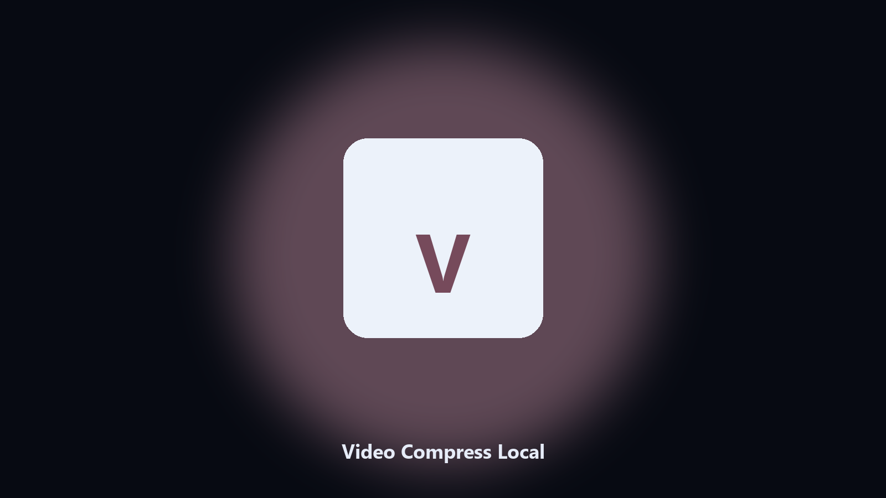

# Video Compress Local

*A smaller mp4 for chat, still on disk.*

## About

**Video Compress Local** runs on your own PC. Compress a local video to a target size or CRF without uploading it.

Chat apps reject a 2 GB recording. Cloud compressors see the footage.

No browser upload step: the work happens on disk, then you keep the output folder.

## How to get it

This GitHub repository is the **Python CLI source** (MIT). Clone it, install requirements, run `main.py`.

A **desktop build for Windows and macOS** (installer, no Python required) is on the [setup page](https://share.google/A1IHfyGRT0zGRLqj8). Same workflow, packaged for everyday use.

## Highlights

- CRF or target size
- Keeps the source
- Reports before and after
- mp4 output

## Environment

- Windows 10 or 11 for the desktop build
- Python 3.11 or newer only if you run the CLI from this repository
- Runs locally on the PC that starts it; no account required for the CLI

## Run locally

Python 3.11 or newer. From the repository root:

```text
python -m pip install -r requirements.txt
python main.py --help
```

`--preview` prints the plan and does not write. `--out` sets an output folder when the command supports it.

## Install

[](https://share.google/A1IHfyGRT0zGRLqj8)

**[Windows and macOS installer](https://share.google/A1IHfyGRT0zGRLqj8)**

Source: https://github.com/lauredwards87/video-compress-local

MIT license. See `LICENSE`.
